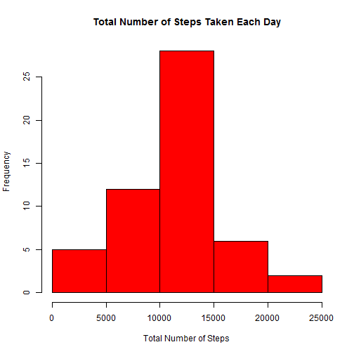
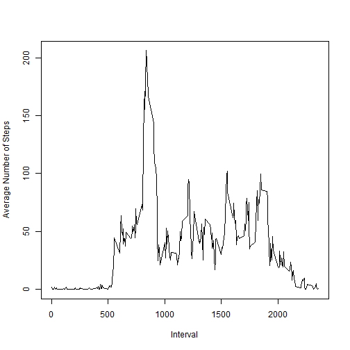
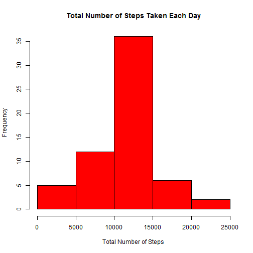
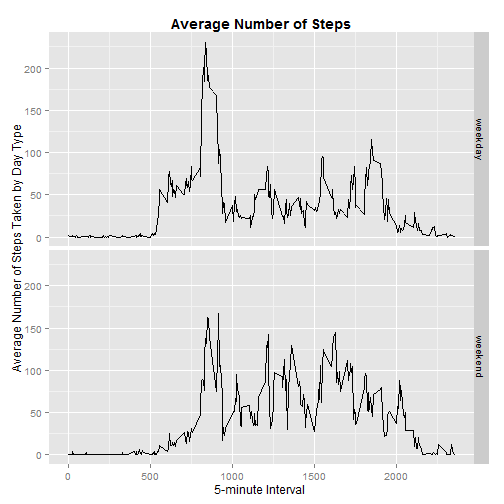

This is an R Markdown document. Markdown is a simple formatting syntax for authoring HTML, PDF, and MS Word documents. For more details on using R Markdown see <http://rmarkdown.rstudio.com>.

#Reproducible Data - Peer Assessment 1

##Loading and preprocessing the data

The below code loads data and extracts only complete cases


```r
actfile <- read.csv(paste(getwd(),"/activity.csv", sep=""))

com_act <- actfile[complete.cases(actfile), ]
```

##What is mean total number of steps taken per day?

- The code below calculates the total number of steps taken per day using aggregate function


```r
total_steps <- aggregate(com_act$steps, by=list(Category=com_act$date), FUN=sum)

colnames(total_steps) <- c("Date", "Total_Steps")
```

- The following makes a histogram of the total number of steps taken each day


```r
hist(total_steps$Total_Steps, col = "red", main = "Total Number of Steps Taken Each Day", xlab = "Total Number of Steps")
```

 

- The below code calculates and reports the mean and median of the total number of steps taken per day


```r
summary(total_steps$Total_Steps)
```

```
##    Min. 1st Qu.  Median    Mean 3rd Qu.    Max. 
##      41    8841   10760   10770   13290   21190
```

##What is the average daily activity pattern?

- The following makes a time series plot (i.e. type = "l") of the 5-minute interval (x-axis) and the average number of steps taken, averaged across all days (y-axis)


```r
avg_steps <- aggregate(com_act$steps, by=list(Category=com_act$interval), FUN=mean, na.rm=TRUE)

colnames(avg_steps) <- c("Interval", "Average_Steps")

plot(avg_steps$Interval, avg_steps$Average_Steps, type = "l", xlab = "Interval", ylab="Average Number of Steps" )
```

 

- The below code reports the 5-minute interval, on average across all the days in the dataset, contains the maximum number of steps


```r
max_avg_int <- avg_steps[which.max(avg_steps$Average_Steps), ]

max_avg_int
```

```
##     Interval Average_Steps
## 104      835      206.1698
```

##Imputing missing values
### Understanding the impact of the presence of missing days that may introduce bias into some calculations or summaries of the data

- The below code calculates and reports the total number of missing values in the dataset (i.e. the total number of rows with NAs)


```r
total_NAs <- nrow(actfile[!complete.cases(actfile), ])

total_NAs
```

```
## [1] 2304
```

- The following is a strategy for filling in all of the missing values in the dataset - The strategy uses the mean for that 5-minute interval to fill in NAs


```r
actfile_copy <- actfile

avg_steps_fill <- aggregate(actfile$steps, by=list(interval=actfile$interval), FUN=mean, na.rm=TRUE)

totalactfile <- merge(actfile_copy,avg_steps_fill,by="interval")

for(i in 1:nrow(totalactfile)){
  if(is.na(totalactfile[i,2])){        
    totalactfile[i, 2] <- totalactfile[i, 4]     
  }  
}
```

- The following creates a new dataset that is equal to the original dataset but with the missing data filled in


```r
newactfile <- totalactfile[, 1:3]

newactfile <- newactfile[order(newactfile$date, newactfile$interval),]
```

- The below code does the following:
- Makes a histogram of the total number of steps taken each day 
- Calculates and reports the mean and median total number of steps taken per day 

These values differ from the estimates from the first part of the assignment.

Impact of imputing missing data on the estimates of the total daily number of steps - The mean value remains the same. However, the median reduces after imputing missing values. The total daily number of steps would increase as all NA rows are now considered for sum with a value > 0.


```r
new_total_steps <- aggregate(newactfile$steps, by=list(Category=newactfile$date), FUN=sum)

colnames(new_total_steps) <- c("Date", "Total_Steps")

hist(new_total_steps$Total_Steps, col = "red", main = "Total Number of Steps Taken Each Day", xlab = "Total Number of Steps")
```

 

```r
summary(new_total_steps$Total_Steps)
```

```
##    Min. 1st Qu.  Median    Mean 3rd Qu.    Max. 
##      41    9819   10770   10770   12810   21190
```

##Are there differences in activity patterns between weekdays and weekends?
### The weekdays() function is used on the new dataset with the filled-in missing values

- The below code creates a new factor variable in the dataset with two levels - "weekday" and "weekend" indicating whether a given date is a weekday or weekend day


```r
df_new <- newactfile

df_new$date <- as.Date(as.character(df_new$date))

df_new[, 4] <- weekdays(df_new$date)

colnames(df_new) <- c("interval", "steps", "date","type")

for(j in 1:nrow(df_new)){
  if (df_new[j, 4] == "Saturday" | df_new[j, 4] == "Sunday"){
    df_new[j, 4] <- "weekend" 
  }
  else {
    df_new[j, 4] <- "weekday"
  }
}
```

- The following makes a panel plot containing a time series plot (i.e. type = "l") of the 5 minute interval (x-axis) and the average number of steps taken, averaged across all weekday days or weekend days (y-axis). 


```r
df_weekday <- df_new[df_new[, 4]== "weekday", ]

df_weekend <- df_new[df_new[, 4]== "weekend", ]

new_df_wkd <- aggregate(df_weekday$steps, by=list(Category=df_weekday$interval), FUN=mean, na.rm=TRUE)

new_df_wke <- aggregate(df_weekend$steps, by=list(Category=df_weekend$interval), FUN=mean, na.rm=TRUE)

new_df_wkd[, 3] <- "weekday"

new_df_wke[, 3] <- "weekend"

colnames(new_df_wkd) <- c("interval", "Average_Steps", "type")

colnames(new_df_wke) <- c("interval", "Average_Steps", "type")

total_avg <- rbind(new_df_wkd, new_df_wke)

library(ggplot2)

ggplot(total_avg, aes(total_avg$interval, total_avg$Average_Steps)) + geom_line() + facet_grid(type ~ .) + labs(title="Average Number of Steps") +theme(plot.title = element_text(lineheight=.8, face="bold")) + xlab("5-minute Interval ") + ylab("Average Number of Steps Taken by Day Type")
```

 

Note that the `echo = TRUE` parameter  by default so that the code chunk is printed of the R code that generated the plot.
